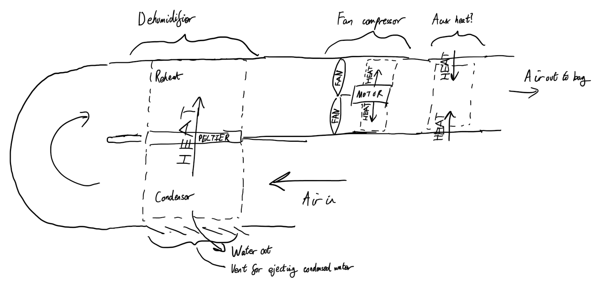
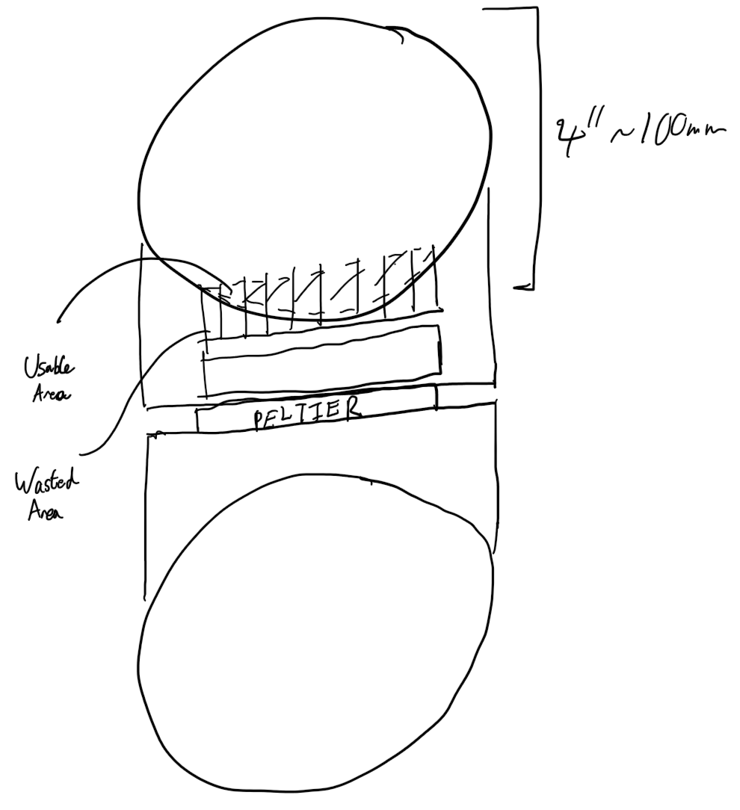
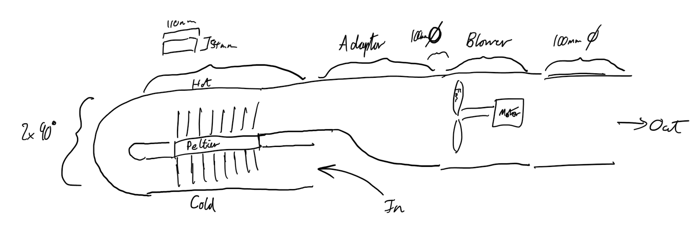
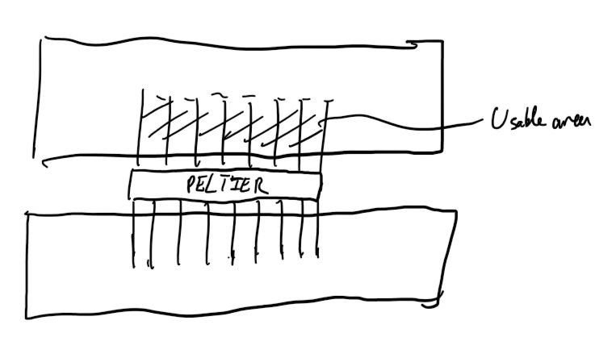
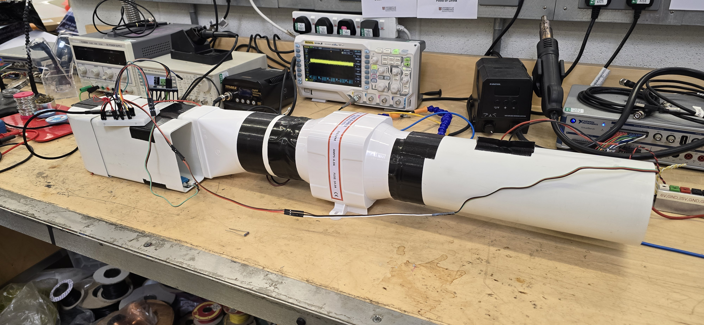
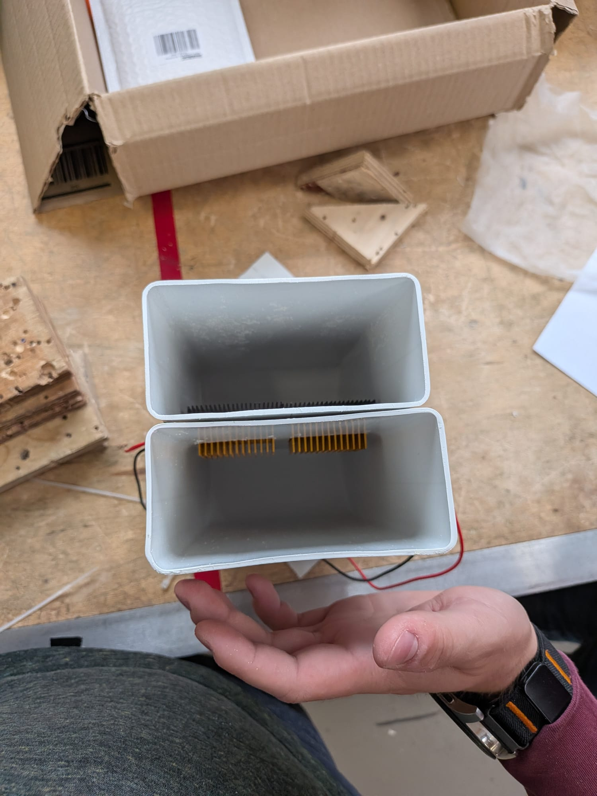
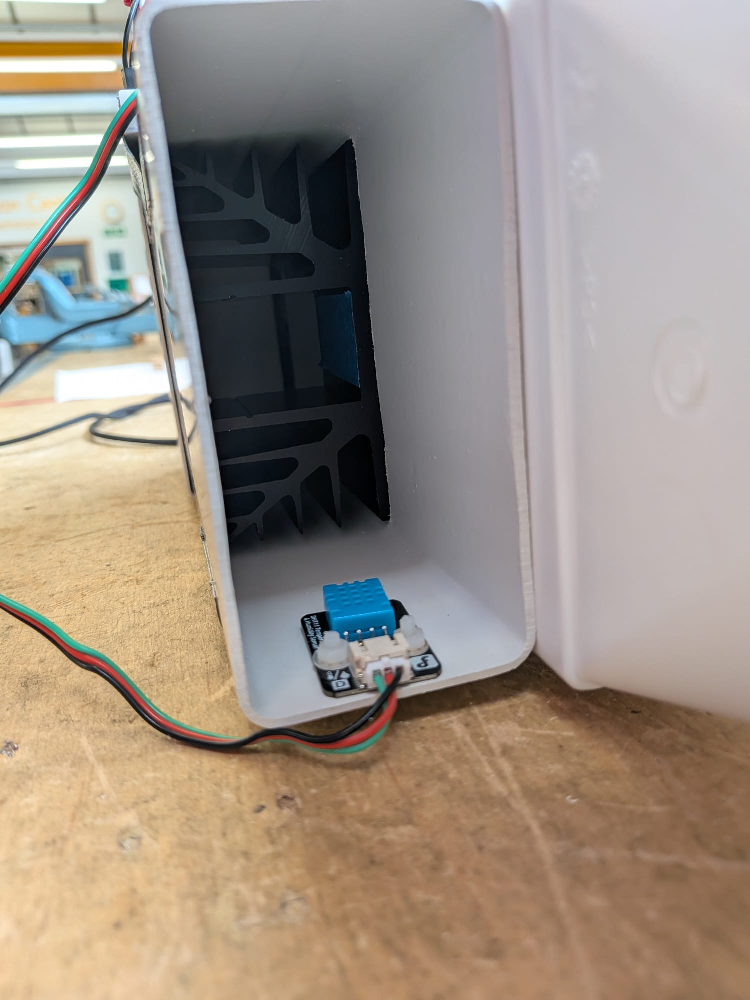
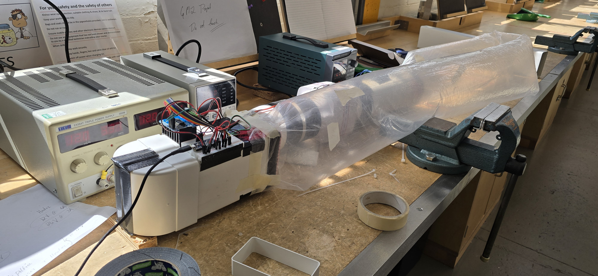

**Author:** James Edwicker

This report details the mechanical developement for the SolarSafe dehumidifier prototype: the design process, the selection of fan and heating devices, and the modifications made after physical testing.

## Prototyping

During our early research into providing drying to the maize, Zac discovered that lowering the relative humidity of the air passing over the maize should have a significant positive impact on the drying capability of any machine we create, rather than just focusing on adding heat as we had first planned.
Josh then proposed the use of Peltier devices, devices which move heat energy from one face to the other, in order to produce a cold surface onto which water can condense and drop out of solution from the air, reducing relative humidity.
This was suggested instead of a refrigerator style device due to the Peltiers' solid state being more robust and reliable (in theory) than a complex and potentially noxious refrigeration cycle.
A chemical desiccator was also disregarded as this would require a constant supply of new, unsaturated material to absorb moisture from the air, or an external heating cycle to restore the chemicals.

Having decided that a Peltier was the suitable device for dehumidification, it was then a matter of creating a device that would allow us to produce an experimental setup to investigate the change in temperature and relative humidity from an inlet to an outlet after passing the air over the Peltiers and any extra heating elements.
An early proposal was to use a ducted fan to blow air over a heating element and the fan's own motor for heat energy input, so this was then expanded to include a section for dehumification.
Since the Peltier draws energy out of a cool side and deposits it in a hot side (plus introduces extra heat energy to the hot side thanks to the power it consumes and the entropy it creates, it was realised that the Peltiers could perform a double duty but initially providing a cool surface onto which water can condense out of the air, then impart heat energy into the dried air from the hot side.
In order to achieve this, the order of air flow was determined to be as follows:

1. Inlet, passing over a temperature and humidity sensor;
2. Cold heat sink on one side of the Peltier;
3. 180 degree U bend to turn the air around so that it can pass across the other side of the Peltier;
4. Hot heat sink on the other side of the Peltier;
5. Blower fan blades;
6. Blower's motor, benefiting from any radiated heat from inefficiencies of the motor;
7. A heating element, effectively a large resistor; and
8. Outlet, passing over a temperature and humidity sensor to compare against the inlet.

## Ducted Blower

Before the duct could be chosen, the fan that it would need to accommodate would need to be chosen.
Creating a performance index to conclusively decide which option is most suitable was difficult as many factors must be taken into consideration:

- Pressure rise across the fan;
- Volumetric flow through the fan;
- The power demands of the fan (both in absolute terms and relative to its performance);
- Price and availability; and
- Voltage and current demands.

Many options were considered, such as PC fans, car radiator fans, and bathroom extractor fans, but the fan that appeared to perform most consistently across all requirements was the bilge blower fan (the document used to compare fans is available on the repository).
The bilge blower appeared an ideal compromise as it used 12V DC, just like the existing SOLARSAFE setup, had decent pressure rise and volumetric flow while maintaining a reasonably low power consumption.
Since these blowers are commonly available for ventilating small internal combustion powered boats, it was also readily available at a moderate price and is feasibly discoverable in Kenya anywhere near the coast or a large river.
This fan also had the benefit of being designed to be included within a duct, matching 4 inch circular tubing.

## Duct Design

Initially, it was planned to use 4 inch piping to produce the ducting to match the blower and to allow rapid construction of the prototype.
C-PVC was initially considered for this device, as this is a version of PVC that can withstand higher temperatures and this is an important consideration with the incorperation of heat sinks and heating elements, however, Josh and Zac had discovered documentation listing 45 degrees Celsius as a maximum limit for heating maize intended for replanting, and 60 degree Celsius as a maximum limit for any heating of the maize (any more and the maize would denature).
This brought the operational constraints of the machine within the material limits of regular uPVC, so this was selected for the ducting.
The plan was to use two T junction pipes to provide the space to insert the Peltier device, but some concept sketches suggested that this approach would result in a large portion of the heat sinks being left without any airflow through of past it, in theory reducing the effectiveness of this design.
The Peltiers are flat, so a transition to 110mm x 54mm rectangular uPVC tubing was made in order to provide a flat surface onto which the Peltiers can be mounted, requiring a square slot to be cut through the inlet and return pipes.
This did require the addition of rectangle to circle adapter for incorperating the round blower duct, but the flat surfaces afforded by the rectangular pipes proved to be very beneficial for ease of construction and effective running of the device.

### Initial Duct Concept

### Initial Heat Sink Concept

### New Duct Concept

### New Heat Sink Concept

## Construction and Refinement

We experienced some difficulties purchasing the components that we wanted to use since some of them could only be found from suppliers not supported by the university's systems, but eventually all of the components we wanted arrived through the help of those in the Dyson Centre and some personal purchases.
Assembling most of the device was straight forward as large sections of PVC could be easily connected using the adaptors, bends, or just some duct tape.
However, there were two significant issues experienced in creating the tight 180 degree turn required to pass air over both sides of the Peltier, and creating a suitable mounting for the Peltier, considering the temperatures that it may reach.
The first issue stemmed from the two 90 degree bends having significant entry and exit necks, resulting in a large gap between the forward and return tubes.
This was corrected by cutting each bend with a band saw and filing them down to meet eachother closely, then securing them to eachother with duct tape for strength and to seal against air escaping.
The second issue was partially solved by using slots in the pipework that were only just larger than the Peltiers to hold them in place.
An option to secure the Peltiers with zip ties was suggested, but some tape worked for our first test.

### Open Loop Construction

## Iteration

In our first test, the device's proof-of-concept was successful, providing a small amount of temperature increase and humidity decrease with the limited power supply at the time, but we noticed that the heat sinks appeared to be relatively ineffective as they had a significant temperature difference to the air, but very little of the air seemed to be exchanging heat with them.
This lead us to purchase much larger heat sinks which were of identical dimensions to the rectangular pipes, ensuring the entire airflow would be exposed to the sinks.
This appeared to work initially, but our second test ended abruptly as the double sided tape used to secure the sinks to the Peltiers went off, allowing the hot sink to separate from one of the Peltiers which then allowed that Peltier to overheat and die.
A redesign was in order to ensure the security of the heat sinks.
Since we had not observed the heat sinks reaching temperatures that would risk damage to the plastic of a ziptie, zipties were wrapped around the heat sinks and Peltiers to ensure there is always a clamping force holding the heat sinks in place.
After this, the machine worked well mechanically.

### Old Heat Sinks

### New Heat Sinks

For the experiments, a couple of nets were mounted to the inlet and outlet, preventing anything large from being sucked into the inlet, or anyone from putting their hand into the outlet and receiving a burn from the heating element near the outlet.
The final change the device underwent was the addition of a flexible plastic tube connecting the outlet to the inlet for a closed-loop test.
This was relatively adhoc, using tape to secure the tube to the outlet first, then using the blower to keep the tube inflated while it was brought around and secured to the inlet using more tape.
This modification appeared to work well for our closed-loop experiments, but it was important to monitor the tube as any nudging or manipulation could lead to the flow through the tube becoming choked and the tube collapsing.
A closed-loop system would probably be beneficial for the final SOLARSAFE design, but attention would need to be paid to this issue of choked flow collapsing the bag, perhaps demanding some ribs around the tube to avoid choking form occurring.

### Closed Loop Construction

