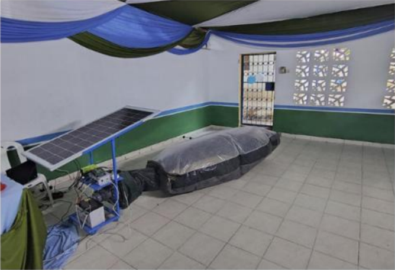
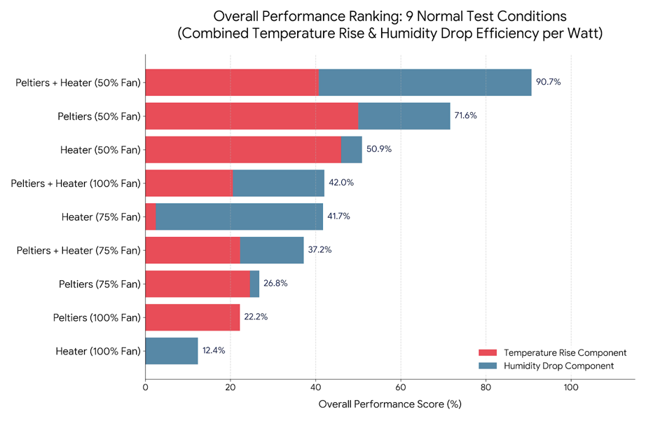

## Navigate to other pages

- [Final Presentation](https://drive.google.com/file/d/11TC1DbZ168yXhvzcBauoJSEwJykbrxR7/view?usp=sharing)

- [Mechanical Design Report](james_edwicker_mechanical_report.md) - Author: James Edwicker
- [Experimental Testing Data Analyses and Evaluation Report](josh_tuckwell_report_data.md) - Author: Josh Tuckwell
- [Electronics Design Report](zac_heggie_electronics_report.md) - Author: Zac Heggie

- [Sustainable Development Goals and Priciples for Digital Development](sustainable_dev_goals.md) 
- [Project Management and Teamwork Statement](teamwork_and_collaboration.md)

## Introduction

In Kenya, and other Sub-Saharan countries, the maize harvest is often blighted by aflatoxin contracted from a fungus that resides in the soil and grows upon the grains if left unchecked.
This poses significant health and financial issues upon the subsitance and co-operative farmers who rely on the maize harvest for their lives and livelihoods.
The traditional methods of drying the grain are not satisfactory for protecting the grains from the toxin and they do not meet the requirements set out by global health organisations, so this leaves the maize as potentially harmful to consume and low-value if sold.
A method of increasing the speed and effectiveness of the drying process, while also avoiding contact with contaminated soil, would greatly improve the quality and safety of the maize.

## The SOLARSAFE Prototype

The SOLARSAFE device at Taita Taveta University aims to address issues with the preparation and storage of maize for prevention of aflatoxin contamination by inflating a plastic bag within which the grain is held.
The bag is designed to provide passive heating through the greenhouse effect, and a fan provides a steady flow of air over the maize to draw moisture out of the crop.
A core feature of this setup is its solar panel providing 150W of power to a 12V car battery.

### Benard's Current SOLARSAFE Device

## Our Contribution

The current prototype in Kenya only features passive heating of the air.
Initially, our goal was to provide modifications to the blower element of the prototype to inject extra heat for greater drying ability.
A review of literature lead to the alteration of this aim to reduce the relative humidity of the air being blown into the bag by any means, not just by heating.
Our intention was to experiment with providing power to various different devices and measure their contribution to reducing the relative humidity of the air so that we would suggest devices which could provide the greatest benefit from the limited power available.
We created a device using PVC pipework, a commercially available blower which would be comparable with something that could be found near Kenya's coast or rivers, a universally available heating element resistor, and some Peltier devices.
Our hope was that the Peltiers would be unlikely to fail if operated correctly, since they are solid state.

## Our Results

Once constructed, we ran our device through a suite of different load combinations to compare the relative drying power of each configuration.
In an open loop, running with both the Peltiers and the heater on and the fan at 50% power produced the greatest drop in relative humidity per Watt consumed, with 50% fan with Peltier or heater following closely behind.
It was a similar story with temperature rise per Watt as this too was dominated by the group of tests running at 50% fan speed.
This implies that the best means of using power to add heat is irrespective of the heating elements used so long as the blower is running at as little power as possible.

We also ran with a closed loop to investigate whether this would work.
While keeping the return well inflated was temperamental, this provided a very large decrease in relative humidity and increase in temperature within the system (17% humidity down from 41% and 36 degrees Celsius up from 21).
This is the most promising portion of our experimentation, so it is our recommendation that some form of reheat system be employed to reach more optimal drying conditions.
See Josh's report on the results for more details.

The Peltier aspect to our design did not seem to function as well as we had hoped.
At no point did we observe any condensation, so stacking Peltiers would be required for this effect.
Additionally, we destroyed two Peltiers by error, so their reliability is questionable.
It would be good to continue testing on closed loops with a drying load, experimenting with stacked Peltiers and venting to help remove water.

### Unified Index of Performance

