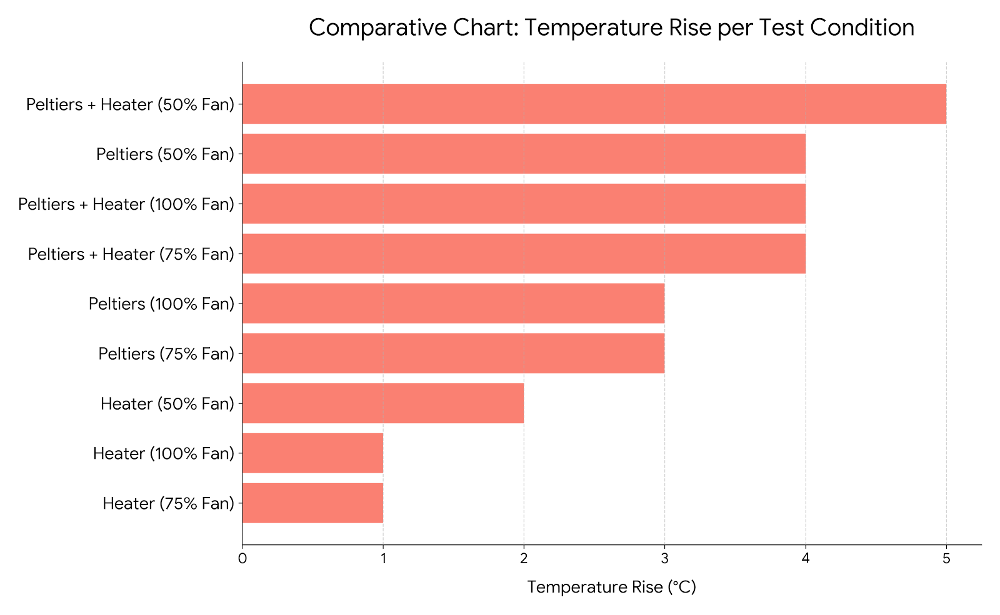
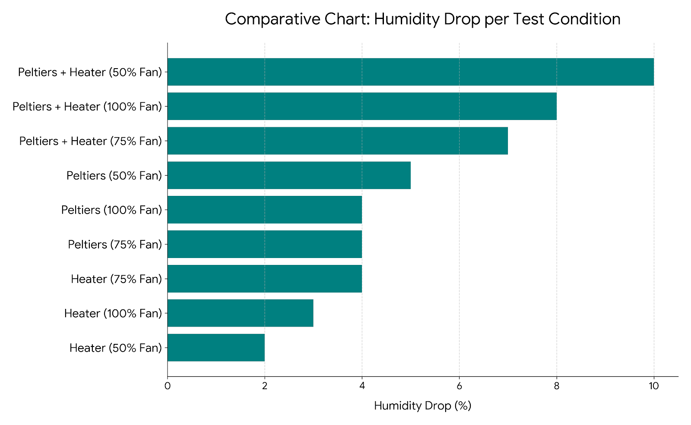
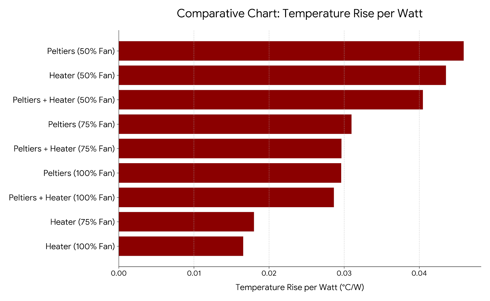
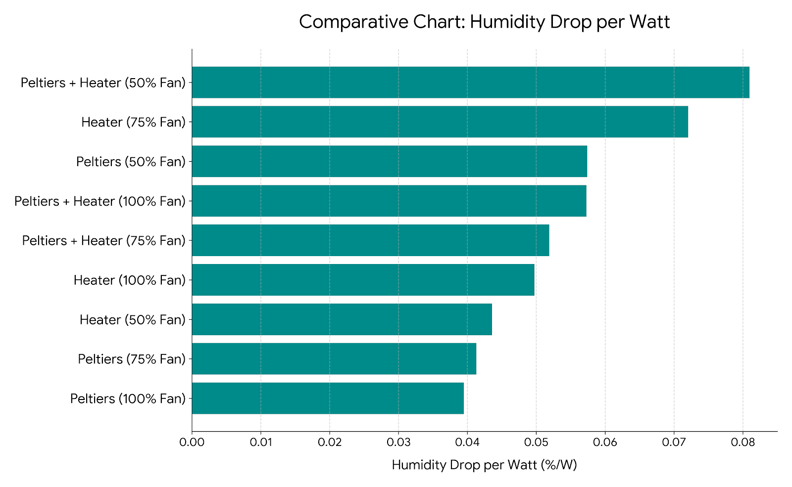
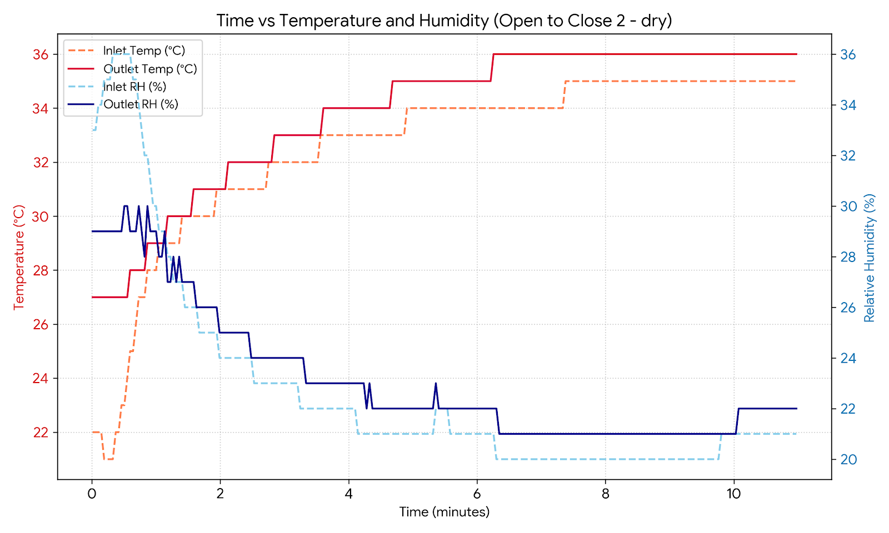

# Results and Data Analysis Report
**Author:** Josh Tuckwell (jdt57)

This report will discuss the design of the experimental test plan and evaluate the performance of the developed dehumidifier prototype. The empirical findings are analysed to determine the optimal component configurations
and assess their practical implications for enhancing Benard’s existing SolarSafe product.

---

## Experimental Test Plan

Following the successful fabrication of the experimental prototype and the integration of dedicated power supplies (see the other 2 reports), empirical testing was initiated. The test matrix was designed to systematically evaluate every 
operational combination of the heating and thermoelectric dehumidifying (Peltier) elements. To assess the impact of airflow rate on system dynamics, each configuration was evaluated across three discrete fan 
duties: 50%, 75%, and 100%. Two additional closed-loop validation tests were appended to evaluate internal recirculation dynamics, establishing the complete 11-test matrix detailed below:

<table>
  <thead>
    <tr>
      <th style="text-align: center;">Test No.</th>
      <th style="text-align: left;">Description</th>
      <th style="text-align: center;">Fan Duty / %</th>
    </tr>
  </thead>
  <tbody>
    <tr>
      <td style="text-align: center; vertical-align: middle;"><b>1</b></td>
      <td rowspan="3" style="text-align: left; vertical-align: middle;">Peltiers + Heater</td>
      <td style="text-align: center; vertical-align: middle;">50</td>
    </tr>
    <tr>
      <td style="text-align: center; vertical-align: middle;"><b>2</b></td>
      <td style="text-align: center; vertical-align: middle;">75</td>
    </tr>
    <tr>
      <td style="text-align: center; vertical-align: middle;"><b>3</b></td>
      <td style="text-align: center; vertical-align: middle;">100</td>
    </tr>
    <tr>
      <td style="text-align: center; vertical-align: middle;"><b>4</b></td>
      <td rowspan="3" style="text-align: left; vertical-align: middle;">Heater</td>
      <td style="text-align: center; vertical-align: middle;">50</td>
    </tr>
    <tr>
      <td style="text-align: center; vertical-align: middle;"><b>5</b></td>
      <td style="text-align: center; vertical-align: middle;">75</td>
    </tr>
    <tr>
      <td style="text-align: center; vertical-align: middle;"><b>6</b></td>
      <td style="text-align: center; vertical-align: middle;">100</td>
    </tr>
    <tr>
      <td style="text-align: center; vertical-align: middle;"><b>7</b></td>
      <td rowspan="3" style="text-align: left; vertical-align: middle;">Peltiers</td>
      <td style="text-align: center; vertical-align: middle;">50</td>
    </tr>
    <tr>
      <td style="text-align: center; vertical-align: middle;"><b>8</b></td>
      <td style="text-align: center; vertical-align: middle;">75</td>
    </tr>
    <tr>
      <td style="text-align: center; vertical-align: middle;"><b>9</b></td>
      <td style="text-align: center; vertical-align: middle;">100</td>
    </tr>
    <tr>
      <td style="text-align: center; vertical-align: middle;"><b>10</b></td>
      <td style="text-align: left; vertical-align: middle;">Closed Loop with Peltiers</td>
      <td style="text-align: center; vertical-align: middle;">75</td>
    </tr>
    <tr>
      <td style="text-align: center; vertical-align: middle;"><b>11</b></td>
      <td style="text-align: left; vertical-align: middle;">Closed Loop with Peltiers and Heater</td>
      <td style="text-align: center; vertical-align: middle;">75</td>
    </tr>
  </tbody>
</table>

Before each test the system was left to reach ambient conditions where the inlet and outlet sensors agreed with each other. The fan duty was then set by controlling it through the Arduino IDE attached in the repository and the 3 power supplies switched on and the current in the peltier's and resistive heater slowly increased to ensure no spikes in Voltage or Current. The system was then left to reach steady state - this normally took somewhere between 5 and 10 minutes. To speed up the time taken for the system to return to ambient was sped up by running the fan initially to help draw heat out of the heatsinks before being switched off until true equilibrium was reached.

---

## Open-Loop Test Results (Tests 1-9)

Ambient baseline conditions remained stable throughout the open-loop testing phase, recorded at an average temperature of 20°C and a relative humidity (RH) of 44%. The initial data set maps the absolute change
in relative humidity ($\Delta\text{RH}$) between the intake sensor (measuring ambient air) and the exhaust sensor at the dehumidifier outlet. 

While raw humidity reduction provides a useful baseline index, it fails to account for the varying electrical loads demanded by each component configuration. To establish a true measure of efficiency, 
the raw data was normalised against power consumption. By plotting temperature lift ($\Delta T/\text{Watt}$) and moisture extraction ($\Delta\text{RH}/\text{Watt}$), the system's specific energy performance 
can be critically analysed.

A notable trend emerged during the 50% fan duty trials, which consistently demonstrated the highest localised performance. This aligns with fundamental thermodynamic principles: 
a lower volumetric flow rate increases the residence time of the air stream across the active elements, allowing a fixed thermal input to heat a smaller mass of air to a higher peak temperature. 
However, to translate these findings effectively to the full-scale SolarSafe system, the total volumetric flow rate must be quantified. Future analyses should evaluate performance metrics in terms of 
$\text{K}\cdot\text{m}^3/(\text{W}\cdot\text{s})$ to account for mass transport. Consequently, the current power-normalised datasets are strictly optimised for comparative evaluation between configurations 
operating at identical fan duties.

Because crop-drying velocity depends heavily on both elevated sensible heat and suppressed relative humidity, these variables are of equal statistical importance to the performance of the SolarSafe unit. 
To synthesize these competing vectors into a singular evaluative tool, a comprehensive performance metric was developed to combine thermal lift and dehumidification capacity.

Cross-comparing configurations at matching fan duties reveals a distinct operational advantage when deploying the Peltier modules and resistance heaters in tandem. This hybrid configuration out-performed 
individual component operation across two out of three fan duties. Crucially, the combined setup provides balanced optimisation — delivering simultaneous thermal lift and moisture removal rather than prioritising 
one over the other. 

This characteristic introduces vital thermodynamic versatility to the SolarSafe system. While a purely heat-optimised system exhibits diminishing returns in tropical, highly humid environments where ambient temperature 
boundaries are already elevated, this dual-action module maintains robust performance profiles across a wider spectrum of localised climatic conditions.

## Closed-Loop Test Results (Tests 10-11)

In open-loop configurations, introducing heat incurs a significant energy premium because thermal energy is continuously exhausted into the environment. Transitioning the system to a closed-loop architecture allows for maximum thermal energy retention within the drying chamber, compounding the temperature lift over time and continually driving down the relative humidity.

To demonstrate this behaviour empirically, a diagnostic test was initiated in an open-loop state before sealing the system. The sensor logs capturing this transition are shown in the graph below:

During the initial open-loop transient phase, a distinct delta is visible between the intake (inlet) and exhaust (outlet) boundaries for both temperature and humidity. Once the loop is physically closed, the system enters an equilibration phase: the inlet and outlet air streams converge as the internal atmosphere continuously recirculates across the dehumidifier module.

Prior to running the formal closed-loop trials, the ambient baseline conditions had shifted slightly to 21°C and 49% relative humidity (RH). The steady-state equilibrium metrics for Test 10 and Test 11 are summarised below:

* **Test 10 (Peltier Modules Only):** Operating at a steady-state power consumption of 94.5W, the internal chamber achieved an equilibrium bag temperature of 31°C, while suppressing the relative humidity down to 22%.
* **Test 11 (Hybrid Peltiers + Heater):** Engaging both the thermoelectric modules and the auxiliary resistance heater increased the total power draw to 127.2W. However, this extra 32.7W of thermal input drove the internal bag temperature up to 36°C and forced the relative humidity down to 17%, which is an excellent result.

These results highlight the profound impact of internal air recirculation. By isolating the system from humid ambient air inputs, the SolarSafe module can create a much drier microclimate inside the storage bag. Hopefully when translated across to the real physical system this will result in an accelerated moisture extraction rate from the maize while using limited power.

There will be some level of experimental error present across all the testing. Both sensors only give results to the nearest whole number and so that gives inherent error bars of plus/minus 0.5°C in every data point. Given the short time span of the project, we could only complete a limited amount of testing. For added confidence in the results repeat experiments and experiments across a larger range of ambient conditions would be preferable.

Rather than running the system at a constant wattage throughout the entire drying cycle, the firmware could be programmed to execute a two-stage drying profile designed around the transient thermodynamic properties of the maize batch:

1. **The High-Power Transient Priming Phase (Initial Stage):**
   At the absolute start of a fresh drying batch, the maize possesses its highest moisture content, and the internal air mass of the storage bag sits at a cold, humid ambient equilibrium. To break this thermal inertia, the microcontroller is configured to "drive the system hard" by injecting maximum available wattage into both the Peltier modules and the auxiliary resistance heaters simultaneously. 
   
   Running the components at peak capacity during this initial stage rapidly forces the internal environment past its transient phase. This high-wattage spike accelerates the initial evaporation rate by quickly establishing a steep vapor pressure differential between the damp maize kernels and the surrounding air, while rapidly heating the internal heatsinks to their optimal operating temperatures.

2. **The Low-Power Steady-State Maintenance Phase (Secondary Stage):**
   Once the integrated sensors signal that the internal chamber has reached its target equilibrium temperature (e.g., 36°C) and the relative humidity has been successfully suppressed, the microcontroller shifts the firmware into a power-saving mode. Because maintaining an established thermal microclimate requires significantly less energy than creating one from scratch, the controller reduces power given to the resistance heater or and peltiers and then adjusts the power to maintain the desired conditions. 

Furthermore, the firmware continuously cross-references these internal state requirements with external ambient conditions. During peak solar hours in hot, dry daytime conditions—where ambient temperatures are naturally elevated—the microcontroller can cycle off the resistance heater entirely and run a low-power Peltier dehumidification mode. 

Conversely, during cool, high-humidity nocturnal or early morning periods, the system automatically triggers the high-efficiency hybrid mode to prevent dew-point condensation inside the storage bag. This intelligent power-allocation strategy optimises the moisture extraction rate while ensuring the module operates safely within the strict battery storage and power limitations of the community's solar infrastructure.

## Conclusion

The experimental analysis of the SolarSafe dehumidifier module demonstrates a successful proof-of-concept for low-power, high-efficiency crop drying mechanism. Through systematic open-loop and closed-loop testing, the project proved that a hybrid configuration combining thermoelectric Peltier modules with targeted resistance heating yields the most versatile and balanced thermodynamic performance. By implementing a closed-loop recirculation architecture, the system isolates the crop from humid ambient air, creating a dry microclimate that suppresses relative humidity down to 17% while maintaining a highly conservative power profile. 

When integrated into Benard’s existing SolarSafe product line, this module offers a scalable, sustainable solution to the threat of post-harvest aflatoxin contamination in Sub-Saharan Africa. By providing smallholder communities with an accessible, solar-powered means of rapidly reaching safe crop moisture thresholds, this engineering intervention directly strengthens local food security, protects public health, and secures higher economic returns for rural farmers.
